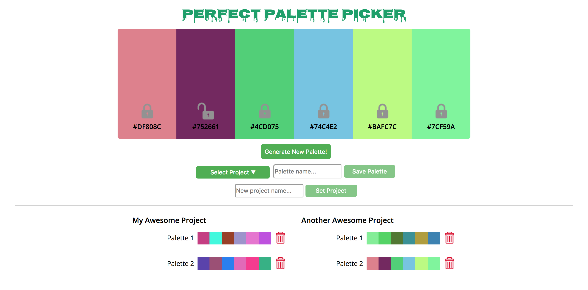

## Palette Picker
#### A web application that helps you generate color palettes built using vanilla JS, jQuery, Express.js with Knex and Postgres, and server-side testing using mocha, chai, and chai-http.

## Project Screen Shot

## Installation and Setup Instructions

Clone down this repository. You will need `npm` installed globally on your machine.  

Installation:

`npm install`  

To Start Server:

`npm start`  

To Visit App:

`localhost:3000/` 

To Run Test Suite:

`npm test`

_Make sure the server has been shut down - tests will run on port 3000..._

## Reflection

This was an individual project to kick off Module 4 at Turing School of Software & Design.  

This was my first time using Firebase but I really enjoyed the opportunity to use the Firebase docs to trouble shoot and build an application using publish/subscribe architecture.  This was also a great opportunity to continue pushing my knowledge and understanding of React which I had just learned on the project before this.

I am very proud of the final codebase and testing coverage my partner and I built out during this two week project.  I learned a lot about Firebase services, React fundamentals and testing and this project was also the first application I deployed (using Firebase) to the web.
